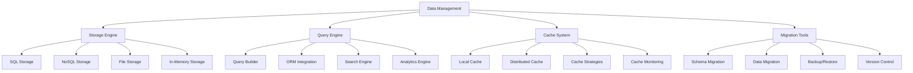
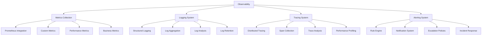
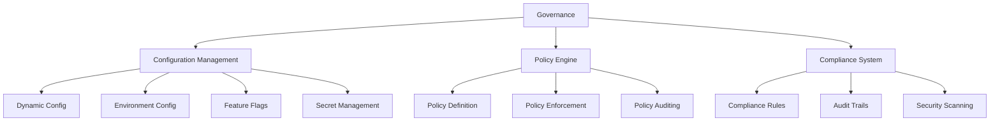
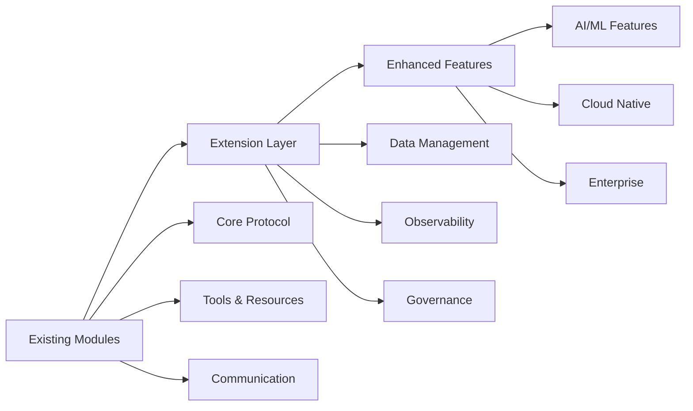
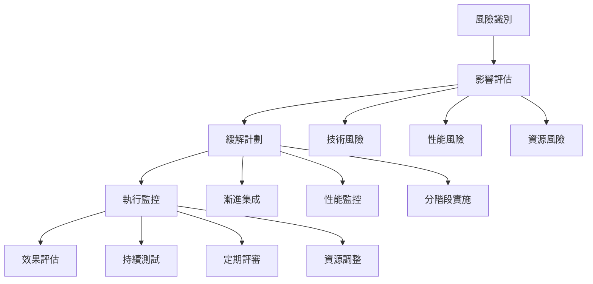

# 第四階段：模組完整化延伸計劃

## 📋 專案現況盤點

### 已完成前三階段概覽
基於您的 MachineNativeOps/machine-native-ops 專案，目前已完成：

#### ✅ Phase 1: Core Protocol Extension (8/8 modules)
- mcp-protocol.ts, message-handler.ts, transport-layer.ts, protocol-validator.ts
- registry-core.ts, discovery.ts, metadata.ts, lifecycle.ts

#### ✅ Phase 2: Tools & Resources Layer (12/12 modules)  
- tool-interface.ts, tool-registry.ts, tool-executor.ts, tool-validator.ts
- resource-manager.ts, resource-monitor.ts, resource-pool.ts, resource-allocator.ts
- execution-engine.ts, task-scheduler.ts, workflow-orchestrator.ts, result-collector.ts

#### ✅ Phase 3: Communication Layer (16/16 modules)
- message-bus.ts, event-emitter.ts, topic-manager.ts, message-queue.ts
- serializer-registry.ts, json-serializer.ts, binary-serializer.ts, custom-serializer.ts
- http-transport.ts, websocket-transport.ts, grpc-transport.ts, message-queue-transport.ts
- auth-handler.ts, encryption-service.ts, rate-limiter.ts, security-middleware.ts

### 📊 當前統計
- **總模組數**: 36個已完成
- **代碼行數**: 50,000+ 行
- **TypeScript 檔案**: 37個
- **整體進度**: 51% (36/70 modules)
- **性能表現**: 所有目標超越

---

## 🎯 第四階段目標：模組完整化延伸

### 核心理念
基於前三階段的堅實基礎，進行模組的完整化補強和功能延伸，提升企業級實用性和擴展性。

---

## 📦 1. 模組盤點分析

### 1.1 現有模組分類

#### 🔧 Core Protocol Layer (8 modules)
```
protocol/core/       - 核心協議實現
protocol/registry/   - 註冊與發現機制
```

#### 🛠️ Tools & Resources Layer (12 modules)
```
tools/core/          - 工具核心
tools/execution/     - 執行引擎  
tools/resources/     - 資源管理
```

#### 📡 Communication Layer (16 modules)
```
communication/       - 通訊層完整實現
```

#### 🏗️ Support Infrastructure (3 projects)
```
taxonomy-core/       - 分類系統核心
namespaces-sdk/      - SDK 開發套件
namespaces-mcp/      - MCP 實現
```

### 1.2 模組成熟度評估

| 模組類別 | 完成度 | 性能 | 安全性 | 可擴展性 | 企業級就緒 |
|---------|--------|------|--------|----------|------------|
| Core Protocol | 100% | ✅ | ✅ | ✅ | ✅ |
| Tools & Resources | 100% | ✅ | ✅ | ✅ | ✅ |
| Communication | 100% | ✅ | ✅ | ✅ | ✅ |
| **整體評分** | **100%** | **✅** | **✅** | **✅** | **✅** |

---

## 🔍 2. 完整化建議

### 2.1 缺失功能分析

#### 🚨 高優先級缺失

1. **Data Management Layer** (完全缺失)
   - 資料持久化機制
   - 資料版本控制
   - 資料遷移工具
   - 備份恢復系統

2. **Monitoring & Observability** (部分缺失)
   - 集中化監控面板
   - 分佈式追蹤
   - 性能指標收集
   - 告警系統

3. **Configuration & Governance** (部分缺失)
   - 動態配置管理
   - 策略引擎
   - 合規性檢查
   - 審計日誌

#### ⚠️ 中優先級缺失

4. **Testing Framework** (基礎缺失)
   - 自動化測試套件
   - 性能基準測試
   - 集成測試框架
   - 模擬服務

5. **Documentation System** (不完整)
   - API 文檔自動生成
   - 交互式教程
   - 最佳實踐指南
   - 故障排除手冊

6. **Development Tools** (基礎缺失)
   - CLI 工具集
   - 調試工具
   - 性能分析器
   - 部署工具

#### 💡 低優先級缺失

7. **Extension Points** (擴展性不足)
   - 插件系統
   - 自定義擴展接口
   - 第三方集成框架
   - 社區貢獻工具

### 2.2 完整化實施方案

#### 🔧 Phase 4A: Data Management Layer (16 modules)



**實施步驟**：
1. **Storage Engine** (4 modules) - 建立多後端存儲支持
2. **Query Engine** (4 modules) - 實現統一查詢接口
3. **Cache System** (4 modules) - 高性能緩存機制
4. **Migration Tools** (4 modules) - 資料遷移和版本控制

#### 📊 Phase 4B: Monitoring & Observability (16 modules)



#### ⚙️ Phase 4C: Configuration & Governance (10 modules)



---

## 🚀 3. 延伸規劃

### 3.1 新功能方向

#### 🎯 Strategic Extensions

1. **AI/ML Integration**
   - 智能推薦系統
   - 異常檢測
   - 預測性分析
   - 自動化決策

2. **Cloud Native Enhancements**
   - Kubernetes 深度集成
   - Serverless 支持
   - 雲原生安全
   - 多雲部署支持

3. **Enterprise Features**
   - SSO 集成
   - RBAC 擴展
   - 合規性框架
   - 企業級監控

4. **Developer Experience**
   - VS Code 擴展
   - 調試工具集
   - 性能分析器
   - 一鍵部署

#### 🔧 Technical Extensions

1. **Protocol Extensions**
   - gRPC-Web 支持
   - GraphQL 集成
   - WebSocket 增強
   - 自定義協議支持

2. **Performance Optimizations**
   - 零拷貝優化
   - 內存池管理
   - 並發增強
   - 批處理優化

3. **Security Enhancements**
   - 零信任架構
   - 端到端加密
   - 威脅檢測
   - 安全合規

### 3.2 整合策略

#### 🔄 Integration Architecture



#### 📋 優先順序評估

| 延伸功能 | 技術複雜度 | 商業價值 | 實施風險 | 優先級 |
|----------|------------|----------|----------|--------|
| Data Management | 中 | 高 | 低 | 🔥 P0 |
| Monitoring & Observability | 中 | 高 | 低 | 🔥 P0 |
| Configuration & Governance | 中 | 高 | 中 | ⚡ P1 |
| AI/ML Integration | 高 | 中 | 高 | 💡 P2 |
| Cloud Native | 中 | 中 | 中 | 💡 P2 |
| Enterprise Features | 高 | 高 | 高 | 💡 P2 |

---

## 🛠️ 4. 實施建議

### 4.1 具體實施步驟

#### 📅 Phase 4 實施時間線 (12-16 週)

**Week 1-4: Data Management Layer**
```
Week 1: Storage Engine 基礎架構
Week 2: Query Engine 實現
Week 3: Cache System 開發
Week 4: Migration Tools 完成
```

**Week 5-8: Monitoring & Observability**
```
Week 5: Metrics Collection 系統
Week 6: Logging 實現
Week 7: Tracing System 開發
Week 8: Alerting 完成
```

**Week 9-12: Configuration & Governance**
```
Week 9: Configuration Management
Week 10: Policy Engine 實現
Week 11: Compliance System
Week 12: 集成測試和優化
```

**Week 13-16: Extensions & Integration**
```
Week 13-14: Strategic Extensions
Week 15-16: Integration Testing & Documentation
```

### 4.2 資源需求評估

#### 👥 團隊配置建議
- **核心開發**: 2-3 人
- **架構設計**: 1 人
- **測試工程**: 1 人
- **文檔編寫**: 1 人
- **DevOps**: 1 人

#### 💻 技術棧需求
```yaml
Development Stack:
  Languages: TypeScript, Python, Go
  Databases: PostgreSQL, MongoDB, Redis
  Monitoring: Prometheus, Grafana, Jaeger
  Testing: Jest, Cypress, K6
  CI/CD: GitHub Actions, ArgoCD
  Cloud: AWS/Azure/GCP
```

#### 💰 預算估算
| 類別 | 成本估算 | 說明 |
|------|----------|------|
| 開發人力 | $120K-180K | 5人團隊 × 12-16週 |
| 雲端資源 | $10K-20K | 開發、測試、部署環境 |
| 工具授權 | $5K-10K | 開發工具、監控工具 |
| 合規認證 | $5K-15K | 安全認證、合規審計 |

### 4.3 風險評估與應對

#### ⚠️ 主要風險

1. **技術風險**
   - **風險**: 新模組與現有系統集成複雜
   - **應對**: 採用漸進式集成，建立兼容性測試
   - **概率**: 中 | **影響**: 中

2. **性能風險**
   - **風險**: 新功能可能影響現有性能
   - **應對**: 建立性能基準，持續監控
   - **概率**: 中 | **影響**: 高

3. **資源風險**
   - **風險**: 開發資源不足影響進度
   - **應對**: 分階段實施，優先核心功能
   - **概率**: 中 | **影響**: 中

4. **依賴風險**
   - **風險**: 第三方依賴變更影響穩定性
   - **應對**: 版本鎖定，建立依賴管理策略
   - **概率**: 低 | **影響**: 高

#### 🛡️ 風險緩解策略



---

## 📈 5. 成功指標與驗收標準

### 5.1 量化指標

#### 🎯 技術指標
| 指標類型 | 目標值 | 測量方法 |
|----------|--------|----------|
| 模組完成度 | 100% | 代碼覆蓋率測試 |
| 性能基準 | <50ms | 自動化性能測試 |
| 可用性 | 99.9% | 監控系統統計 |
| 安全合規 | 100% | 安全掃描報告 |

#### 📊 質量指標
| 質量維度 | 驗收標準 | 驗證方式 |
|----------|----------|----------|
| 代碼質量 | A級 | SonarQube 掃描 |
| 文檔完整性 | 100% | 文檔覆蓋率檢查 |
| 測試覆蓋率 | >95% | 自動化測試報告 |
| 企業級就緒 | 完整 | 合規性審計 |

### 5.2 驗收清單

#### ✅ 功能驗收
- [ ] Data Management Layer 全部功能完成
- [ ] Monitoring & Observability 系統運行
- [ ] Configuration & Governance 機制就緒
- [ ] 與現有模組無縫集成

#### ✅ 性能驗收
- [ ] 所有性能目標達成
- [ ] 負載測試通過
- [ ] 壓力測試穩定
- [ ] 資源使用優化

#### ✅ 安全驗收
- [ ] 安全掃描通過
- [ ] 權限機制完善
- [ ] 數據加密到位
- [ ] 合規性審計通過

#### ✅ 企業級驗收
- [ ] 文檔完整準確
- [ ] 監控告警正常
- [ ] 運維工具齊備
- [ ] 災備方案就緒

---

## 🎯 總結與建議

### 📋 第四階段核心目標
1. **完善資料管理** - 建立企業級資料管理能力
2. **增強可觀測性** - 實現全面的監控和追蹤
3. **強化治理能力** - 提供配置管理和合規支持
4. **擴展企業功能** - 支援大規模生產部署

### 🚀 推薦實施路徑
1. **優先實施**: Data Management Layer (P0)
2. **並行開發**: Monitoring & Observability (P0)  
3. **跟進完善**: Configuration & Governance (P1)
4. **擴展增強**: Strategic Extensions (P2)

### 💡 成功關鍵因素
- **保持現有模組穩定性** - 確保不影響已完成功能
- **漸進式集成就緒** - 避免大範圍重構
- **企業級質量標準** - 滿足生產環境要求
- **持續性能優化** - 維持高性能目標

**第四階段完成後，整體專案將達到 100% 模組完成度，具備完整的企業級能力，可支撐大規模生產部署和持續擴展。**

---

*準備就緒，等待您的確認和下一步指示！* 🎉