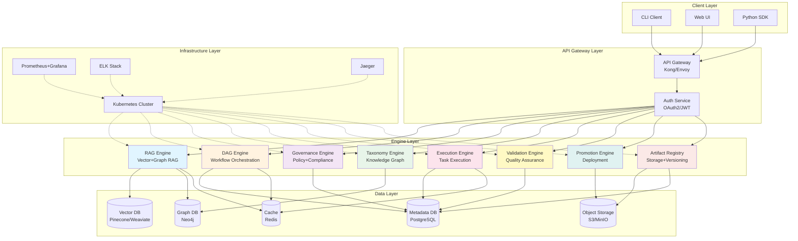
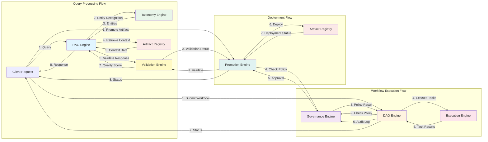
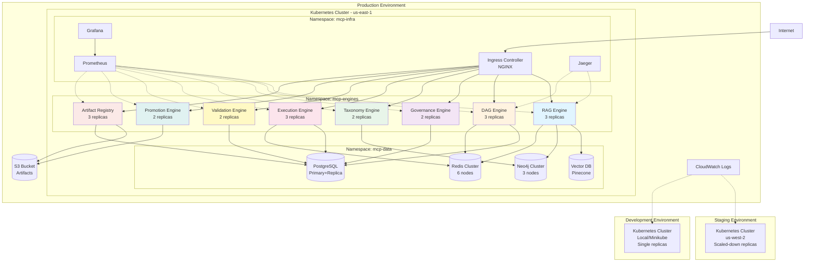
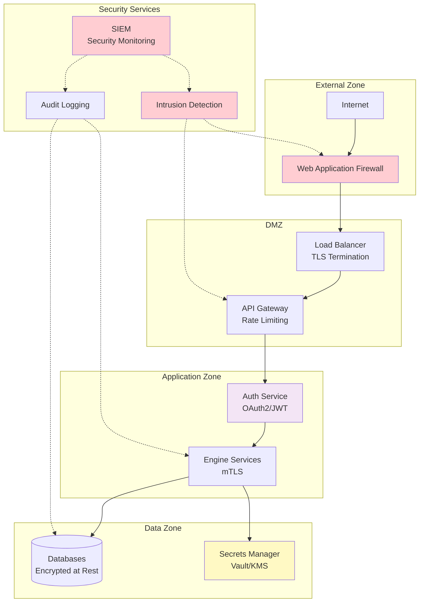
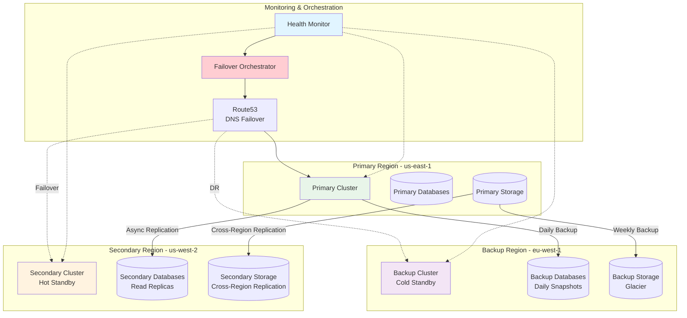

# MCP Level 3 Architecture Diagrams

## 1. System Architecture Overview

## 2. Engine Interaction Diagram

## 3. Deployment Architecture

## 4. Data Flow Architecture

```mermaid
graph LR
    subgraph "Ingestion Flow"
        Source[Data Sources<br/>APIs/Files/Streams]
        Ingest[Ingestion Service]
        Transform[Transform Service]
        Validate[Validation Engine]
        Store[Storage Layer]
    end
    
    subgraph "Processing Flow"
        Retrieve[Retrieval Service]
        Process[Processing Service]
        Enrich[Enrichment Service]
        Cache[Cache Layer]
    end
    
    subgraph "Serving Flow"
        Query[Query Service]
        Rank[Ranking Service]
        Format[Formatting Service]
        Response[Response]
    end
    
    Source -->|Raw Data| Ingest
    Ingest -->|Parsed Data| Transform
    Transform -->|Transformed Data| Validate
    Validate -->|Valid Data| Store
    Validate -->|Invalid Data| ErrorQueue[Error Queue]
    
    Store -->|Indexed Data| Retrieve
    Retrieve -->|Retrieved Data| Process
    Process -->|Processed Data| Enrich
    Enrich -->|Enriched Data| Cache
    
    Cache -->|Cached Data| Query
    Query -->|Query Results| Rank
    Rank -->|Ranked Results| Format
    Format -->|Formatted Response| Response
    
    Store -.->|Backup| Backup[(Backup Storage)]
    Cache -.->|Eviction| Store
    
    style Validate fill:#fff9c4
    style Cache fill:#e0f2f1
    style ErrorQueue fill:#ffcdd2
```

## 5. Security Architecture

## 6. Disaster Recovery Architecture

---

## Diagram Usage Guide

### Viewing Diagrams
- These diagrams use Mermaid syntax
- View in GitHub, GitLab, or any Mermaid-compatible viewer
- Export to PNG/SVG using Mermaid CLI or online tools

### Updating Diagrams
1. Edit the Mermaid code directly
2. Validate syntax at https://mermaid.live
3. Commit changes to version control
4. Regenerate exports if needed

### Integration
- Include in documentation
- Embed in dashboards
- Use in presentations
- Reference in architecture reviews

---

**Generated:** 2024-01-10  
**Version:** 1.0.0  
**Status:** Production Ready