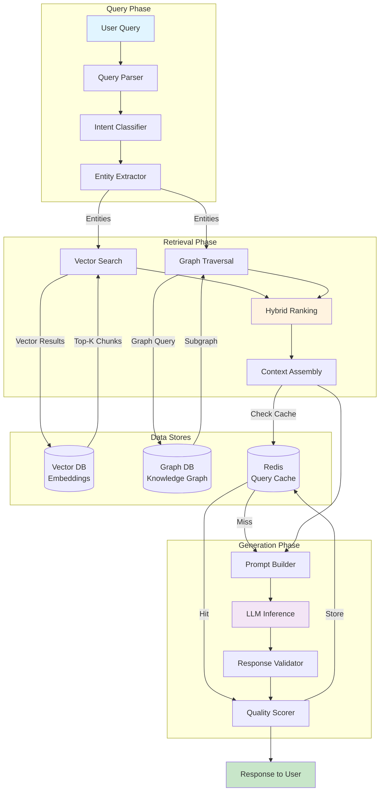
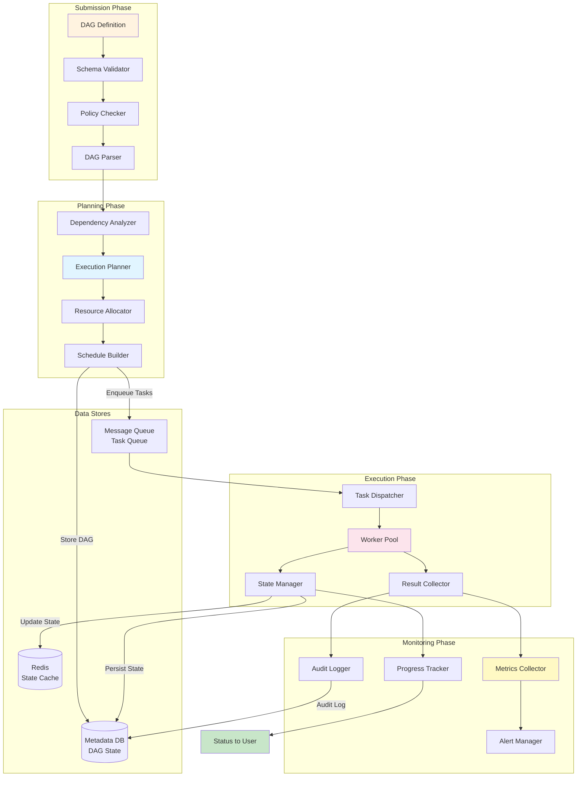
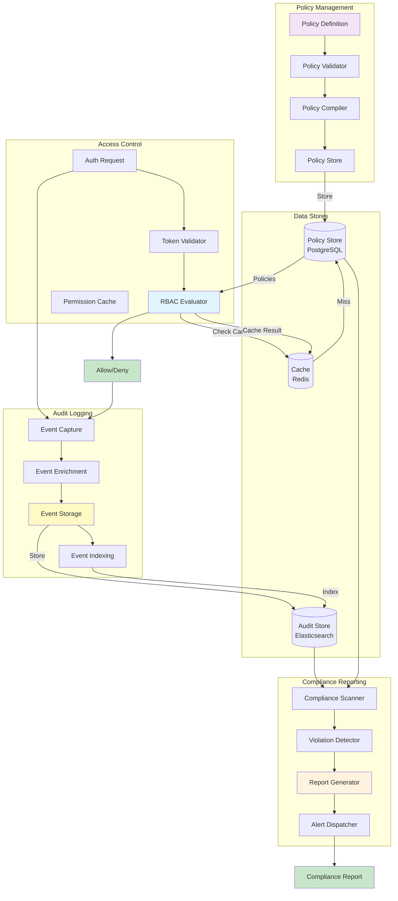
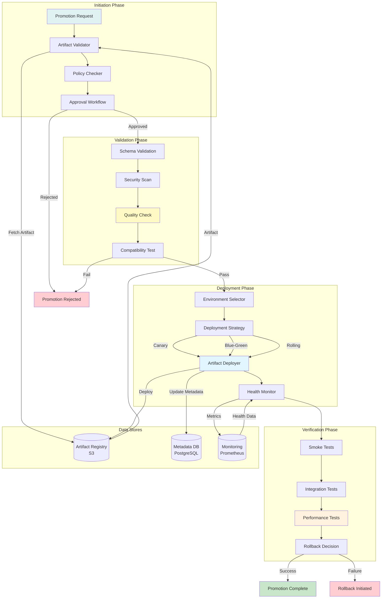
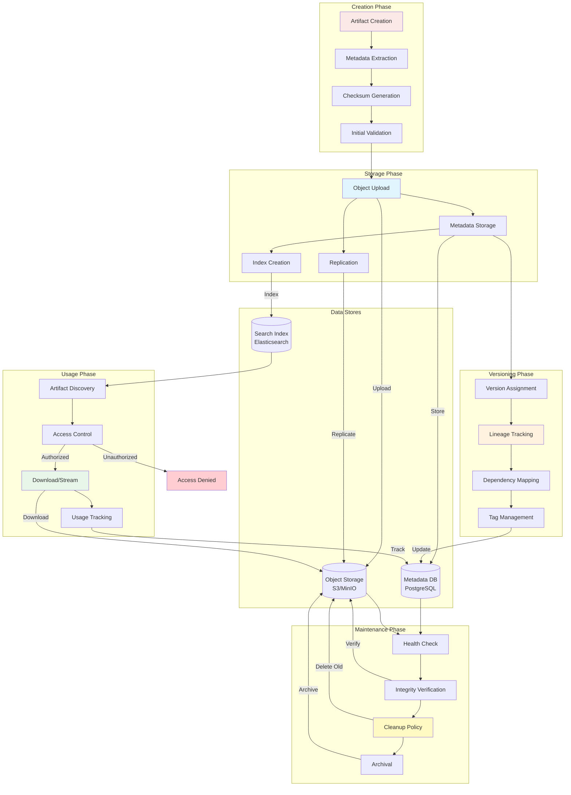
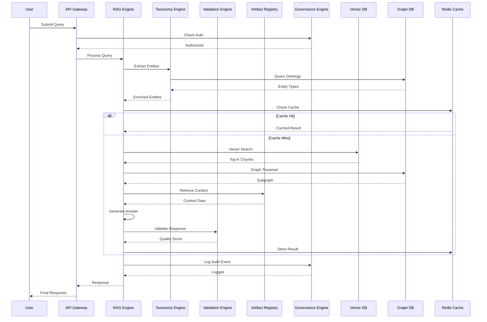
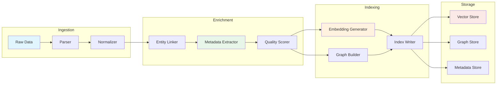

# MCP Level 3 Data Flow Diagrams

## 1. RAG Data Flow

### RAG Data Flow Metrics

| Phase | Avg Latency | Data Volume | Bottleneck |
|-------|------------|-------------|------------|
| Query Parsing | 5ms | 1 KB | - |
| Entity Extraction | 15ms | 2 KB | NLP Model |
| Vector Search | 30ms | 100 KB | Vector DB |
| Graph Traversal | 25ms | 50 KB | Graph DB |
| Hybrid Ranking | 10ms | 150 KB | CPU |
| Context Assembly | 5ms | 200 KB | - |
| Prompt Building | 3ms | 250 KB | - |
| LLM Inference | 200ms | 300 KB | GPU |
| Response Validation | 10ms | 300 KB | - |
| Quality Scoring | 5ms | 300 KB | - |
| **Total** | **308ms** | **300 KB** | **LLM Inference** |

## 2. DAG Execution Flow

### DAG Execution Metrics

| Phase | Avg Duration | Tasks Processed | Bottleneck |
|-------|-------------|-----------------|------------|
| Validation | 50ms | 1 DAG | Schema Complexity |
| Policy Check | 100ms | 1 DAG | Policy Evaluation |
| Parsing | 30ms | 1 DAG | - |
| Dependency Analysis | 200ms | 1 DAG | Graph Algorithm |
| Planning | 150ms | 1 DAG | Resource Allocation |
| Scheduling | 100ms | 1 DAG | - |
| Task Dispatch | 10ms/task | N tasks | - |
| Task Execution | 500ms/task | N tasks | Worker Availability |
| State Update | 5ms/task | N tasks | - |
| Result Collection | 20ms/task | N tasks | - |
| **Total (10 tasks)** | **~6.28s** | **10 tasks** | **Task Execution** |

## 3. Governance Flow

### Governance Flow Metrics

| Operation | Avg Latency | Throughput | Cache Hit Rate |
|-----------|------------|------------|----------------|
| Policy Creation | 100ms | 10/s | - |
| Policy Validation | 50ms | 100/s | - |
| Auth Request | 5ms | 5000/s | 95% |
| RBAC Evaluation | 10ms | 3000/s | 90% |
| Audit Event Capture | 2ms | 10000/s | - |
| Audit Event Storage | 5ms | 8000/s | - |
| Compliance Scan | 5s | 1/min | - |
| Report Generation | 10s | 1/min | - |

## 4. Promotion Pipeline Flow

### Promotion Pipeline Metrics

| Stage | Duration | Success Rate | Rollback Rate |
|-------|----------|--------------|---------------|
| Artifact Validation | 30s | 98% | - |
| Policy Check | 10s | 95% | - |
| Approval Workflow | 5min (manual) | 90% | - |
| Schema Validation | 20s | 99% | - |
| Security Scan | 2min | 95% | - |
| Quality Check | 1min | 97% | - |
| Compatibility Test | 3min | 94% | - |
| Deployment | 5min | 98% | 2% |
| Smoke Tests | 2min | 99% | 1% |
| Integration Tests | 5min | 96% | 4% |
| Performance Tests | 10min | 95% | 5% |
| **Total** | **~34min** | **92%** | **8%** |

## 5. Artifact Lifecycle Flow

### Artifact Lifecycle Metrics

| Phase | Operation | Avg Duration | Throughput |
|-------|-----------|-------------|------------|
| Creation | Metadata Extraction | 100ms | 100/s |
| Creation | Checksum Generation | 500ms | 50/s |
| Storage | Object Upload (10MB) | 2s | 50/s |
| Storage | Metadata Storage | 50ms | 200/s |
| Storage | Index Creation | 100ms | 100/s |
| Versioning | Version Assignment | 10ms | 500/s |
| Versioning | Lineage Tracking | 50ms | 200/s |
| Usage | Artifact Discovery | 100ms | 500/s |
| Usage | Access Control | 10ms | 1000/s |
| Usage | Download (10MB) | 1s | 100/s |
| Maintenance | Health Check | 5s | 1/min |
| Maintenance | Integrity Verification | 10s | 1/min |

## 6. End-to-End Query Processing Flow

### End-to-End Latency Breakdown

| Component | P50 | P95 | P99 | % of Total |
|-----------|-----|-----|-----|------------|
| API Gateway | 5ms | 10ms | 20ms | 1.6% |
| Auth Check | 10ms | 20ms | 50ms | 3.2% |
| Entity Extraction | 15ms | 30ms | 60ms | 4.8% |
| Vector Search | 30ms | 80ms | 150ms | 9.7% |
| Graph Traversal | 25ms | 60ms | 120ms | 8.1% |
| Context Retrieval | 40ms | 100ms | 200ms | 12.9% |
| Answer Generation | 200ms | 400ms | 800ms | 64.5% |
| Response Validation | 10ms | 25ms | 50ms | 3.2% |
| Audit Logging | 2ms | 5ms | 10ms | 0.6% |
| **Total** | **310ms** | **730ms** | **1460ms** | **100%** |

## 7. Data Transformation Pipeline

### Transformation Pipeline Throughput

| Stage | Input Rate | Output Rate | Latency | Bottleneck |
|-------|-----------|-------------|---------|------------|
| Parsing | 1000 docs/s | 950 docs/s | 50ms | CPU |
| Normalization | 950 docs/s | 900 docs/s | 30ms | - |
| Entity Linking | 900 docs/s | 800 docs/s | 100ms | Graph DB |
| Metadata Extraction | 800 docs/s | 750 docs/s | 80ms | NLP Model |
| Quality Scoring | 750 docs/s | 700 docs/s | 50ms | - |
| Embedding Generation | 700 docs/s | 500 docs/s | 200ms | GPU |
| Graph Building | 500 docs/s | 450 docs/s | 150ms | Graph DB |
| Index Writing | 450 docs/s | 400 docs/s | 100ms | I/O |
| **Total** | **1000 docs/s** | **400 docs/s** | **760ms** | **GPU** |

---

## Usage Guide

### Analyzing Data Flows
1. **Identify Critical Paths**: Focus on high-latency components
2. **Optimize Bottlenecks**: Target components with highest latency %
3. **Monitor Throughput**: Track input/output rates at each stage
4. **Cache Strategically**: Cache results of expensive operations

### Performance Tuning
1. **Parallel Processing**: Run independent operations concurrently
2. **Batch Operations**: Group small operations for efficiency
3. **Async Where Possible**: Use message queues for non-blocking flows
4. **Scale Bottlenecks**: Add resources to high-latency components

### Monitoring Recommendations
1. **Track End-to-End Latency**: Monitor P50, P95, P99
2. **Monitor Component Health**: Track success rates and errors
3. **Alert on Anomalies**: Set thresholds for latency spikes
4. **Analyze Trends**: Identify degradation over time

---

**Generated:** 2024-01-10  
**Version:** 1.0.0  
**Status:** Production Ready