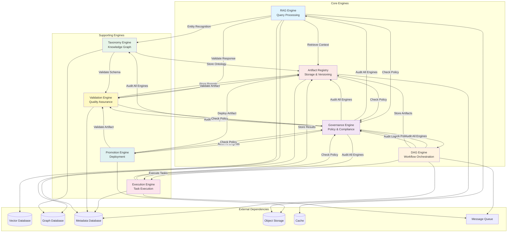
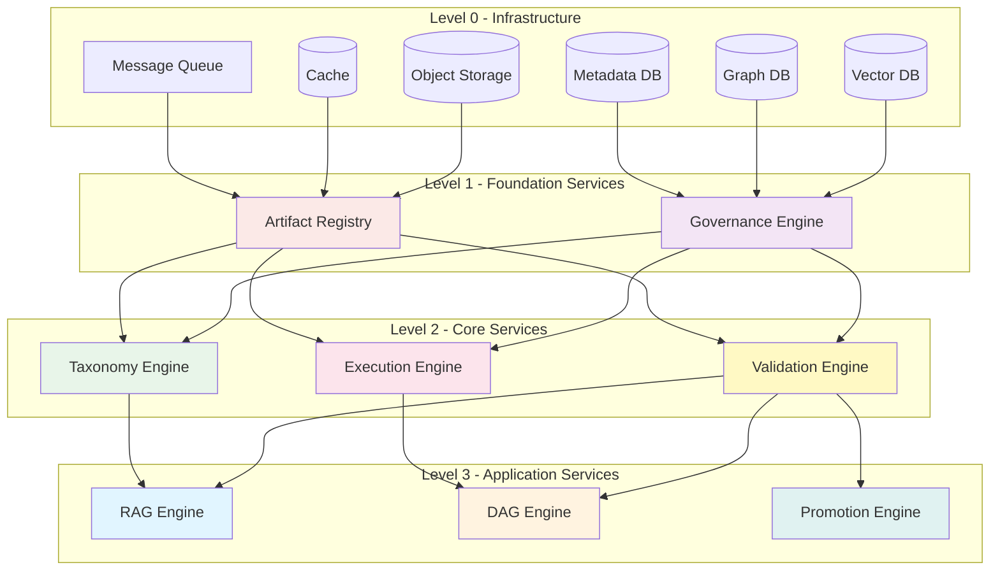
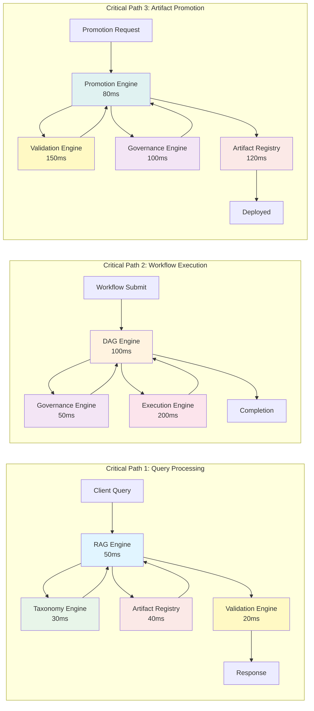
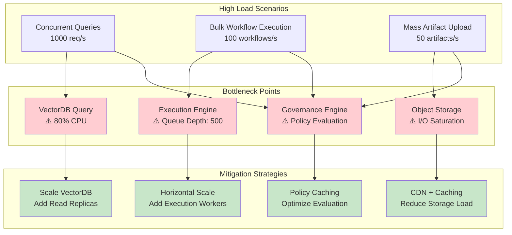
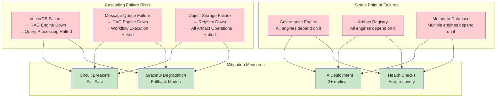
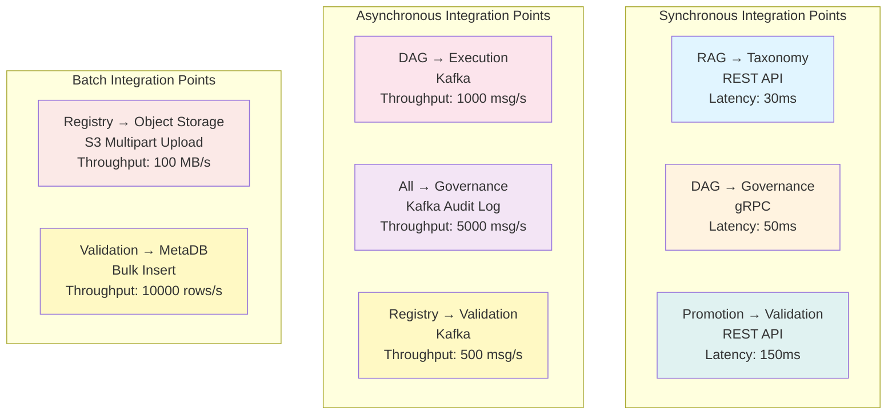
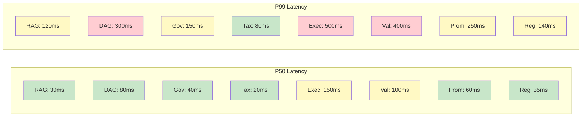

# MCP Level 3 Dependency Graphs

## 1. Inter-Engine Dependency Graph

## 2. Service Dependency Matrix

| Service | Depends On | Depended By | Criticality |
|---------|-----------|-------------|-------------|
| **RAG Engine** | Taxonomy, Validation, Registry, Governance, VectorDB, GraphDB, Cache | - | HIGH |
| **DAG Engine** | Execution, Governance, Registry, MetaDB, MQ | - | HIGH |
| **Governance Engine** | MetaDB | RAG, DAG, Taxonomy, Execution, Validation, Promotion, Registry | CRITICAL |
| **Taxonomy Engine** | Registry, Validation, GraphDB | RAG | MEDIUM |
| **Execution Engine** | Governance, Registry, MetaDB, MQ | DAG | HIGH |
| **Validation Engine** | Registry, Governance, MetaDB | RAG, Taxonomy, Promotion, Registry | HIGH |
| **Promotion Engine** | Validation, Governance, Registry, ObjectStore | - | MEDIUM |
| **Artifact Registry** | Validation, Governance, ObjectStore, MetaDB | RAG, DAG, Taxonomy, Execution, Validation, Promotion | CRITICAL |

### Dependency Levels

## 3. Critical Path Analysis

### Critical Path Metrics

| Path | Total Latency | Bottleneck | Optimization Target |
|------|--------------|------------|---------------------|
| Query Processing | 140ms | RAG Engine (50ms) | Cache optimization, parallel retrieval |
| Workflow Execution | 350ms | Execution Engine (200ms) | Async execution, task batching |
| Artifact Promotion | 450ms | Validation Engine (150ms) | Incremental validation, parallel checks |

## 4. Bottleneck Analysis

## 5. Failure Mode Analysis

## 6. Integration Point Mapping

## 7. Performance Characteristics

### Latency Distribution

### Throughput Capacity

| Engine | Max Throughput | Recommended Load | Scaling Strategy |
|--------|---------------|------------------|------------------|
| RAG Engine | 2000 req/s | 1500 req/s | Horizontal (add replicas) |
| DAG Engine | 500 workflows/s | 350 workflows/s | Horizontal + Queue |
| Governance Engine | 5000 req/s | 3500 req/s | Horizontal + Cache |
| Taxonomy Engine | 1000 req/s | 700 req/s | Horizontal + GraphDB scale |
| Execution Engine | 200 tasks/s | 150 tasks/s | Horizontal + Worker pool |
| Validation Engine | 300 validations/s | 200 validations/s | Horizontal + Async |
| Promotion Engine | 100 promotions/s | 70 promotions/s | Horizontal + Queue |
| Artifact Registry | 500 uploads/s | 350 uploads/s | Horizontal + CDN |

---

## Usage Guide

### Analyzing Dependencies
1. **Identify Critical Services**: Focus on Governance and Registry (CRITICAL)
2. **Plan Scaling**: Use dependency levels to scale bottom-up
3. **Monitor Bottlenecks**: Track metrics for high-load scenarios
4. **Implement Failover**: Address single points of failure first

### Performance Optimization
1. **Reduce Latency**: Optimize critical path components
2. **Increase Throughput**: Scale bottleneck services
3. **Cache Aggressively**: Especially for Governance policies
4. **Async Where Possible**: Use message queues for non-critical paths

### Failure Mitigation
1. **Deploy HA**: 3+ replicas for critical services
2. **Implement Circuit Breakers**: Prevent cascading failures
3. **Enable Graceful Degradation**: Fallback to cached data
4. **Monitor Health**: Auto-restart failed services

---

**Generated:** 2024-01-10  
**Version:** 1.0.0  
**Status:** Production Ready